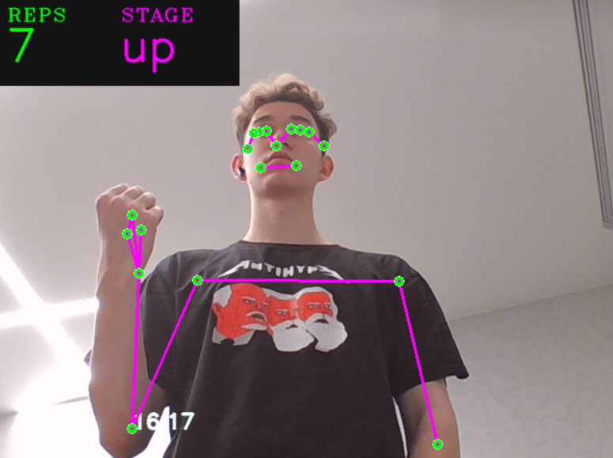

### Описание проекта
Это приложение использует компьютерное зрение для подсчета поднятий на бицепс (bicep curls) в реальном времени. 
С помощью библиотеки ```Mediapipe``` анализируется поза человека, а ```Streamlit``` и ```WebRTC``` обеспечивают потоковую передачу видео с веб-камеры.

#### Как это работает:
1. Приложение захватывает видео с вашей веб-камеры.
2. Определяет ключевые точки тела (плечо, локоть, запястье).
3. Вычисляет угол между этими точками.
4. Считает количество поднятий на бицепс, когда угол достигает определенных значений.

#### Используемые технологии:
- ```Mediapipe```: Для анализа позы и обнаружения ключевых точек.
- ```Streamlit```: Для создания веб-интерфейса.
- ```WebRTC```: Для потоковой передачи видео в реальном времени.

### Демонстрация работы алгоритма:

